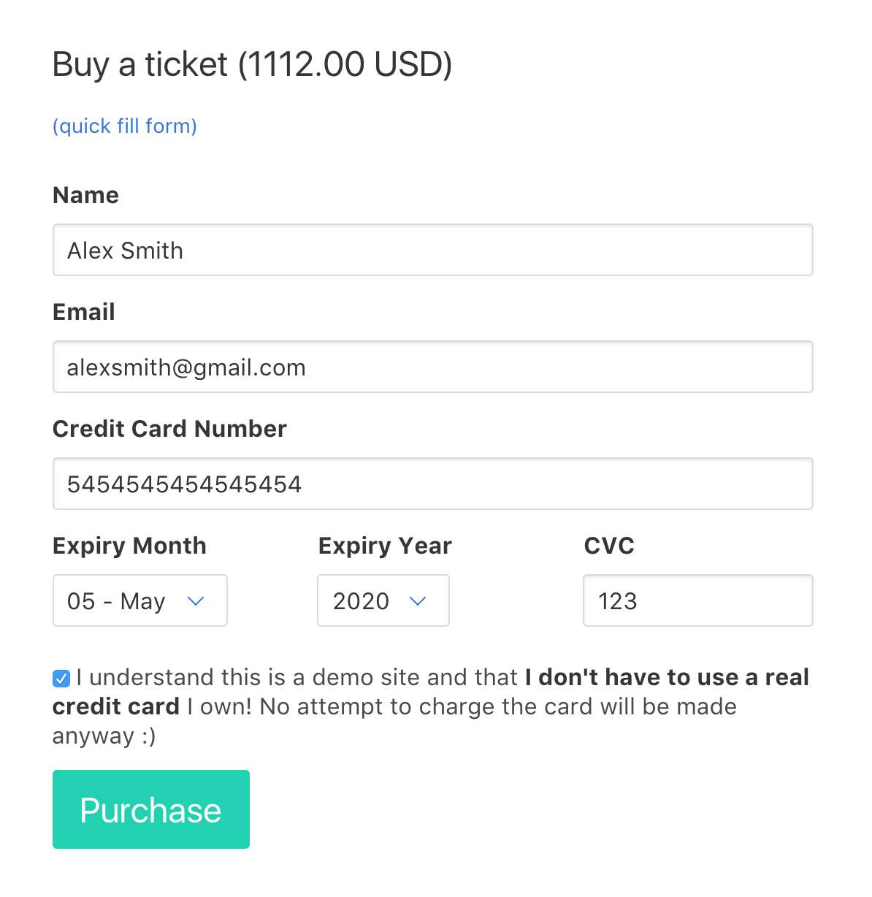
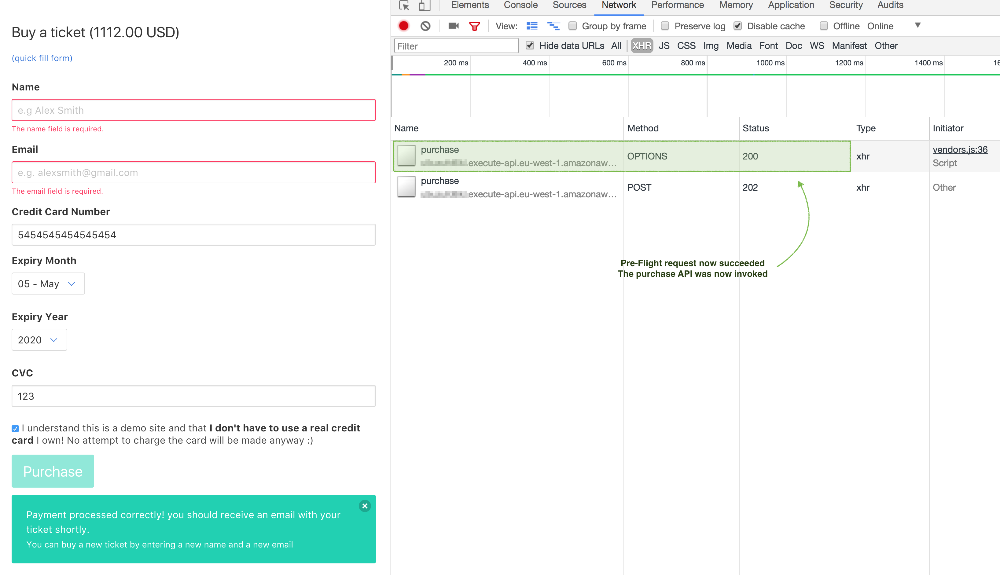

# Ticketless — getting started with Serverless and Lambda functions

| Previous lesson  | Next lesson      |
| :--------------- | ---------------: |
| [◀︎ 05 — Integrating API with DynamoDB](../05-api-with-dynamodb)| [07 — SNS and SQS ▶︎](../07-sns-and-sqs) |


## Lesson 06 — Purchase ticket API


### Goal

In this lesson we will learn how to create an API that receives data through an HTTP POST request. How to do validation in lambdas and how to use external libraries.

If you are already familiar with those concepts you can use the following Cloudformation template to apply the changes expected by this lesson and move forward to the next lesson.

**TODO**: add Cloudformation template


### Contents

- [Using external dependencies from NPM](#0601---using-external-dependencies-from-npm)
- [API for tickets purchase](#0602---api-for-tickets-purchase)
- [Exposing the new API in the template](#0603---exposing-the-new-api-in-the-template)
- [Enabling CORS for non-GET requests](#0604---enabling-cors-for-non-get-requests)


## 06.01 - Using external dependencies from NPM

In the Lambda functions code it is possible to use external dependencies from NPM as in any other Node.js project.

In order to use external dependencies, we have to create a `package.json` file in our `src` folder.

To do so, move your command line inside the `src` folder and run:

```bash
npm init -y
```

This command will create a default package file.

Now, in the same folder, we can install any library by just running:

```bash
npm install --save <libraryName>
```

In our next function we will need to write some validation code, so we can use the `validator` library. To install this library we have tu run:

```bash
npm install --save validator
```

If everything went fine, you will notice that in our `src` folder we now have a `node_modules/validator` subfolder.

At this point, we can require this library in our Lambda code with:

```javascript
const validator = require('validator')
```

> 💡 **TIP**: The uncompressed source code in Lambda needs to be smaller than 250MB ([source](http://docs.aws.amazon.com/lambda/latest/dg/limits.html)). When using dependencies this way, dependency files (including development dependencies) are moved into the lambda code and, in large projects, you might end up hitting this hard limit. In these cases, it might be worth to adopt tools like [Webpack](https://webpack.js.org) and/or [Rollup](https://rollupjs.org/) to compile the code, process the dependency tree and make sure to include in the resulting file only the dependencies functionalities that are really used in your application code ([tree-shaking](https://webpack.js.org/guides/tree-shaking/)).


## 06.02 - API for tickets purchase

A big part of our application is to be able to sell tickets for the gigs.

In every gig page, the frontend already exposes a form to do the purchase at the bottom of the page.



When you fill the form and hit the *Purchase* button, the frontend will submit the data to an API located in `/purchase` with a `POST` request.

In this section we will implement the Lambda function for this endpoint.

### API specification

The purchase ticket API expects as input (request body) a JSON string representing an object with the following attributes:

  - `gig`: (`string` | `required`) the slug of an existing gig
  - `name`: (`string` | `required`) the name and surname of the ticket owner
  - `email`: (`string` | `required`) the email of the ticket owner
  - `cardNumber`: (`string` | `required`) the credit card number to charge for the ticket
  - `cardExpiryMonth`: (`string` | `required`) a value between 1 and 12 representing the expiry month of the credit card
  - `cardExpiryYear`: (`string` | `required`) a value between 2018 and 2024 representing the expiry year of the credit card
  - `cardCVC`: (`string` | `required`) 3 or 4 digits representing the CVC of the credit card
  - `disclaimerAccepted`: (`boolean` | `required`) a boolean flag that must be set to `true` to indicate that the user accepted the terms and conditions of the payment.

A valid request payload would look like the following:

```json
{
  "gig":"joy-division-london-1979",
  "name":"Alex Smith",
  "email":"alexsmith@gmail.com",
  "cardNumber":"5454545454545454",
  "cardExpiryMonth":"5",
  "cardExpiryYear":"2020",
  "cardCVC":"123",
  "disclaimerAccepted":true
}
```

The API we want to implement needs to process the input, verify that it's a valid JSON and validate every field.

  - If everything is OK the API will return a `202 Accepted` with body `{"success": true}`.

  - If the request body is not a valid JSON it should a `400 Bad Request` with body `{"error": "Invalid content, expected valid JSON"}`

  - If one or more fields are missing or are not valid the API should respond with a `400 Bad Request` with a JSON body containing a list of all the errors as per the following example:

  ```json
  {
    "error": "Invalid request",
    "errors": [
      { "field": "fieldName", "message": "error message"}
    ]
  }
  ```

**Note** that the API doesn't really try to attempt to charge the given credit card but, for the sake of this tutorial, only checks if the format looks valid. Be good, **NO MONEY SHOULD BE TAKEN** from the given credit card 😇

You can add the code as a new function in `index.js` by following this template:


```javascript
// ...
const validator = require('validator')

exports.purchaseTicket = (event, context, callback) => {

  let data

  // parses the input
  try {
    data = JSON.parse(event.body)
  } catch (err) {
    // 1. handle the case of invalid JSON
    // ...
  }

  // validates every field
  const errors = []

  // gig: needs to be an existing gig
  if (!data.gig) {
    errors.push({field: 'gig', message: 'field is mandatory'})
    // you can optionally try to validate if the gig exists in DynamoDB
  }

  // 2. validate all other fields
  // ...

  if (errors.length) {
    // 3. handle the case of validation errors
    // ...
  }

  // 4. if everything went well return a 202 (accepted)
  // ...
}

// ...
```

> 💡 **TIP**: Checkout the official page of the [`validator`](http://npm.im/validator) module to see some examples on how to use it.

If you don't want to go ahead alone or you just want to check your implementation against mine you can find it in [`resources/lambda/purchase-ticket-api`](/resources/lambda/purchase-ticket-api).


## 06.03 - Exposing the new API in the template

When you are happy with the implementation of the API, you have to expose the API in API Gateway through the `template.yaml`:

```yaml
# ...

Resources:

  # ...

  purchaseTicket:
    Type: AWS::Serverless::Function
    Properties:
      CodeUri: ./src
      Handler: index.purchaseTicket
      Runtime: nodejs6.10
      Role: !GetAtt GigsApiRole.Arn
      Events:
        Endpoint:
          Type: Api
          Properties:
            Path: /purchase
            Method: post

# ...
```

At this point, we are ready to deploy the new version of our Application:

```bash
sam package --template-file template.yaml --s3-bucket $DEPLOYMENT_BUCKET --output-template-file packaged.yaml
sam deploy --region eu-west-1 --template-file packaged.yaml --stack-name $STACK_NAME --capabilities CAPABILITY_IAM
```


## 06.04 - Enabling CORS for non-GET requests

It's now time to go to our frontend and try to purchase a ticket.

If you did everything correctly in the previous steps, you should see... this error! 😅


This errors happens as part of the CORS protocol.

When some JavaScript code in the browser invokes an XHR request to another domain, the browser might issue a [Pre-Flight request](https://developer.mozilla.org/en-US/docs/Glossary/Preflight_request) to check if the destination API can receive call from the current domain (where the website is running).

During Pre-flight the browser sends an OPTIONS request before your actual request gets sent, which the server typically responds with the options available e.g POST, PUT etc.. along with that in the headers will be Access Control rules.

> 💡 **TIP**: If you need more detail on how CORS actually works, check out this brilliant article: [Understanding CORS and Pre-Flight](http://www.authenticdesign.co.uk/understanding-cors-and-pre-flight/)


In order to make our API work, we need to add CORS support to our application.

We can do that by creating a Lambda that can respond to the Pre-Flight Request and map it to any `OPTIONS` request in API Gateway.

This is the Lambda code you need to add in the `index.js` file:

```javascript
// ...

exports.cors = (event, context, callback) => {
  callback(null, {
    statusCode: 200,
    headers: {
      'Content-Type': 'application/json',
      'Access-Control-Allow-Origin': '*',
      'Access-Control-Allow-Methods': '*',
      'Access-Control-Allow-Headers': 'Content-Type,Authorization,X-Amz-Date,X-Api-Key,X-Amz-Security-Token'
    },
    body: ''
  })
}
```

And this is the code to add to the template file to expose this Lambda to any `OPTIONS` request.

```yaml
# ...

Resources:

  # ...

  CORS:
    Type: AWS::Serverless::Function
    Properties:
      CodeUri: ./src
      Handler: index.cors
      Runtime: nodejs6.10
      Events:
        Endpoint:
          Type: Api
          Properties:
            Path: /{path+}
            Method: options
```

> 💡 **TIP**: the syntax `/{path+}` in the `Path` parameter means that the request can match any path in order to trigger the lambda as long as the method is `OPTION` (since we are specifying the constraint).

Now we are ready to deploy our app again:

```bash
sam package --template-file template.yaml --s3-bucket $DEPLOYMENT_BUCKET --output-template-file packaged.yaml
sam deploy --region eu-west-1 --template-file packaged.yaml --stack-name $STACK_NAME --capabilities CAPABILITY_IAM
```

At this stage, when we test our purchase form again we should see a nice green success message 🤑:



> 💡 **TIP**: AWS is working on making the CORS integration as simple as adding `Cors: true` in the SAM template. When this feature will be released this step will become much easier. Check out the [dedicated issue on GitHub](https://github.com/awslabs/serverless-application-model/issues/23) to know the status of this feature.


## Verify

If you did everything correctly you should now have the purchase form working.

You can easily test it by visiting a gig page and by filling the form (you can use the *quick fill form* to speed up the process).

If you see a green success message saying that the payment was processed correctly you can be happy and move to the next lesson!

---

| Previous lesson  | Next lesson      |
| :--------------- | ---------------: |
| [◀︎ 05 — Integrating API with DynamoDB](../05-api-with-dynamodb)|  [07 — SNS and SQS ▶︎](../07-sns-and-sqs) |
